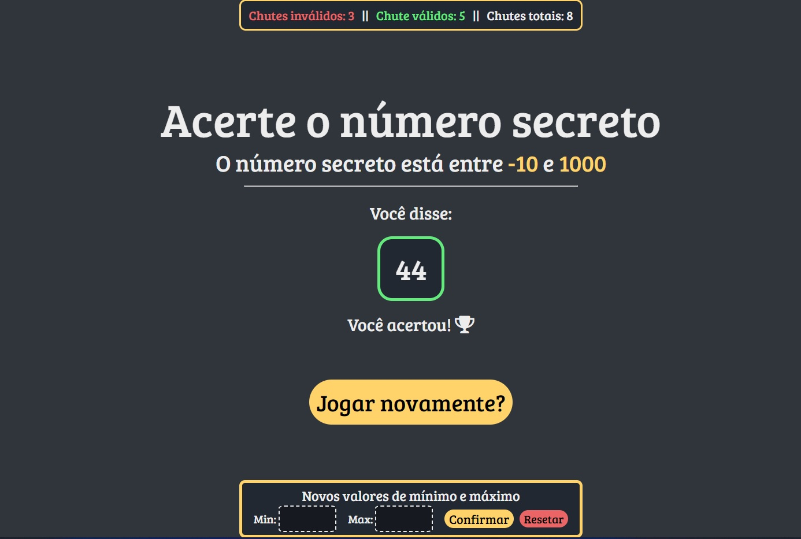

# web_speech_guessing_game_pt-br
A web number guessing game that uses voice recognition as input

This project was made while following a class on how to use the Web Speech API, so it can be seen just a fun practice project :)  
And, as you might have guessed by the title, this project was made in brazilian portuguese, I made this because I plan on playing this game with other portuguese speaking people, so it just made more sense that way.

  
## Instructions  
> Note that you need to have python installed to run the app  

**Running the app**

- After downloading or cloning this repo, unpack it (if it came compressed), and open the terminal in the root directory (the one where, for example, this README.md is located).  
- Then run `python -m venv ./server_venv` to create the virtual enviroment.
- Next run `.\server_venv\Scripts\Activate.ps1` (for powershell) or `.\server_venv\Scripts\activate.bat` (for regular cmd) to activate the venv.
- To install the dependencies run `pip  install -r requirements.txt`.
And, at last, run python `.\app.py` to launch the app and type **localhost:5000** on your browser to use the app.  

> If you wish to stop the application type CTRL+C on the terminal that is running the server.

**Modifing the app**
- **TODO: write this part**